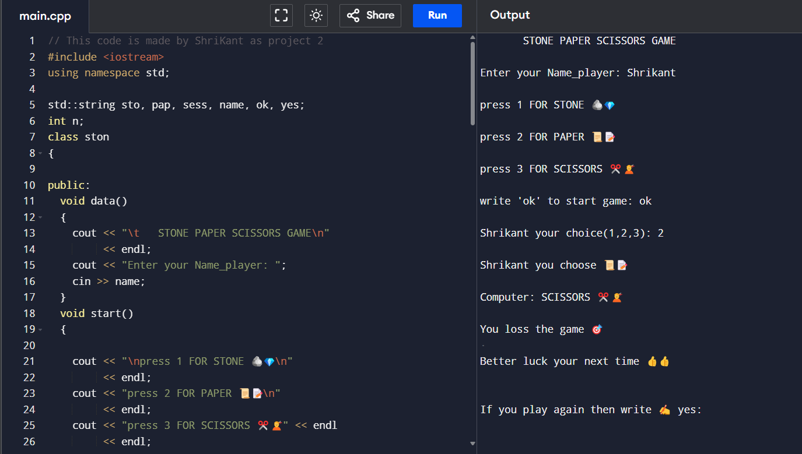

### ✅ **Corrected README.md (C++ Version)**

```markdown
# 🪨📄✂️ Stone-Paper-Scissors Game (C++ Version)

## 🎯 About the Project
This is a **Stone-Paper-Scissors** game written in **C++** as a console application. The game allows the user to play against the computer, where the computer's move is predefined. The user can play multiple rounds by selecting **"yes"** after each round.

## 🚀 Features
- Simple console-based **Stone-Paper-Scissors** game.
- User can enter their **name** for a personalized experience.
- Includes emoji-based UI to make it visually appealing.
- Allows multiple rounds of gameplay.

## ⚙️ Technologies Used
- **C++**
- **Standard Library (iostream)**

## 🛠️ How to Run
1. Clone the repository:
```bash
git clone https://github.com/ShriKant114/My-first-project
```

2. Compile the program:
```bash
g++ stone_paper_scissors.cpp -o game
```

3. Run the program:
```bash
./game
```

## 🎮 Gameplay Instructions
1. Choose your move:
    - Press `1` for Stone 🪨  
    - Press `2` for Paper 📜  
    - Press `3` for Scissors ✂️  
2. The computer will display its move.
3. The result will be shown.
4. You can choose to play again by entering **"yes"**.

## 🖼️ Game Screenshot


## 👥 Contributing
Feel free to contribute by opening issues or creating pull requests. 

## 📄 License
This project is licensed under the MIT License.
```
